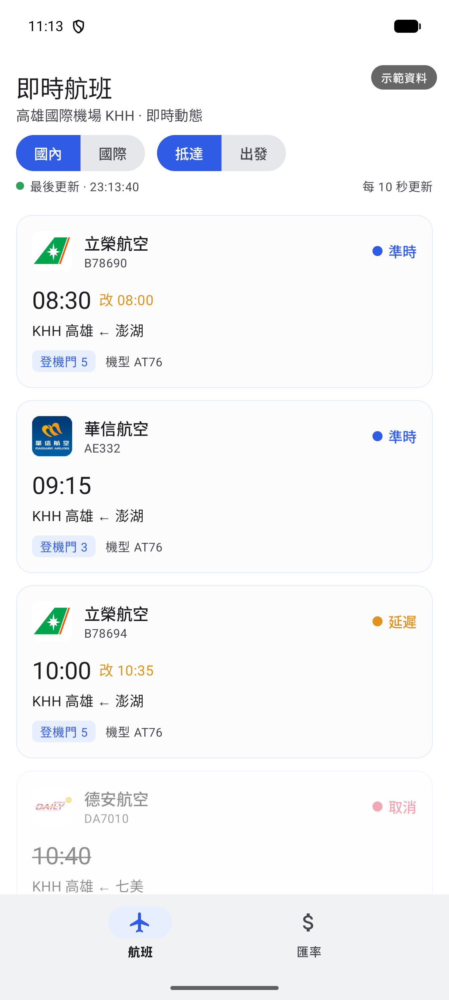
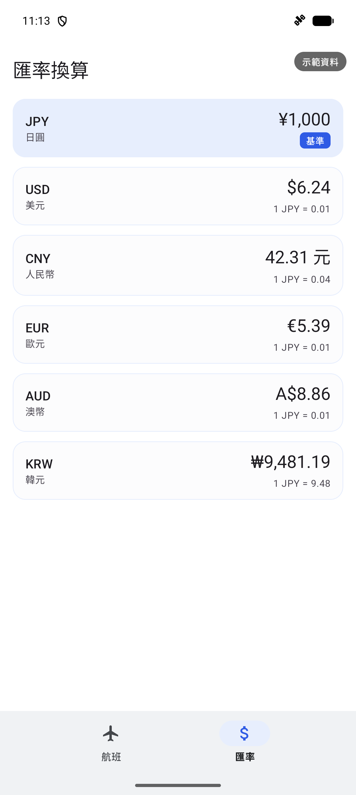
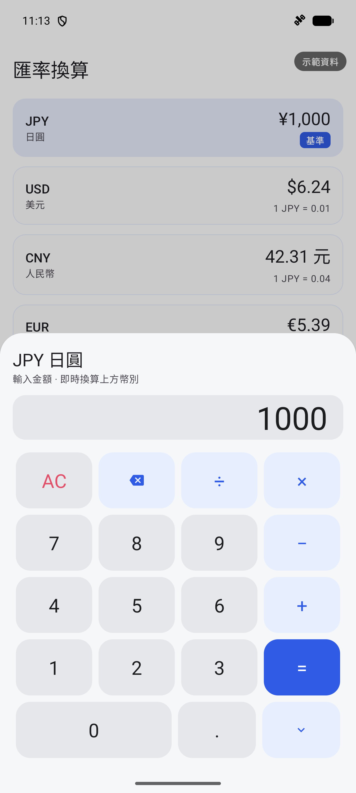
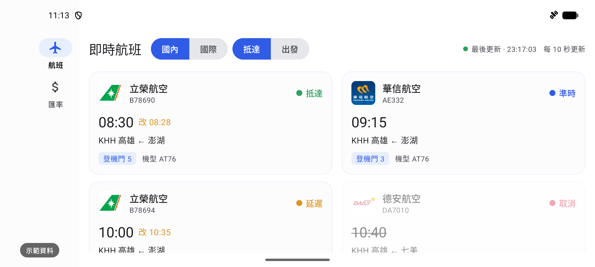
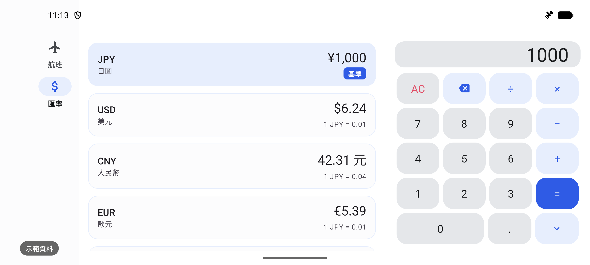
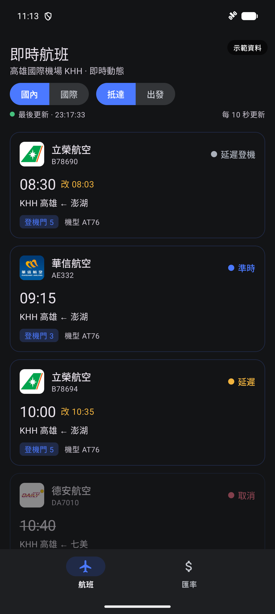

# FlightFX

高雄國際機場航班即時資訊 × 多幣別匯率換算的 Android App。

Kotlin・MVVM + Clean Architecture・傳統 View(XML + ViewBinding)

## 功能

**航班**
- 高雄國際機場(KHH)即時航班看板,每 10 秒自動更新(lifecycle-aware,退到背景即停止輪詢)
- 國際/國內 × 出發/抵達 四種類別切換
- 狀態徽章(準時/延遲/登機/取消/抵達/離站)、改點時間標示、航空公司徽章
- 骨架載入動畫、下拉重整、離線偵測(離線顯示橫幅並保留前次資料,恢復自動重連)

**匯率**
- 六種幣別即時匯率,任一幣別可設為基準
- 點選幣別開啟計算機,輸入金額**即時連動**更新整張清單(無需按 `=`)
- 支援四則運算,`=` 求值後同樣即時換算
- 匯率啟動時抓取一次並快取,不高頻消耗 API 額度

**通用**
- 深色模式跟隨系統
- 直向(底部導覽 + BottomSheet 計算機)/ 橫向(NavigationRail + 雙欄網格、master-detail 計算機側欄)兩套版面

## Demo 影片

[](https://youtu.be/eY2zBcD5BfA)

2 分 20 秒操作示範:冷啟動、航班看板與每 10 秒自動更新、四類切換、計算機即時連動與四則運算、離線偵測與自動恢復、橫向佈局、深色模式 → https://youtu.be/eY2zBcD5BfA

## 截圖

> 截圖為內建「示範資料」模式(右上角浮水印),涵蓋各種航班狀態以利展示;實際執行時串接機場即時 API。

| 航班即時看板 | 匯率換算 | 計算機 |
|:---:|:---:|:---:|
|  |  |  |

| 橫向:NavigationRail + 雙欄網格 | 橫向:清單 + 計算機側欄(master-detail) |
|:---:|:---:|
|  |  |

| 深色模式(跟隨系統) |
|:---:|
|  |

## 架構

MVVM + Clean Architecture,單一 module,`domain` 層為純 Kotlin、不依賴 Android:

```
com.michaelliu.flightfx
├── di/        Hilt modules
├── data/      remote(api/dto)、mapper、repository 實作
├── domain/    model、repository 介面、usecase
├── ui/        flight、currency(含計算機)、common、MainActivity
└── util/      共用工具(CurrencyFormatter 等)
```

- 非同步:Coroutines + Flow(輪詢、網路狀態、UI state 皆以 Flow 建模)
- 列表:RecyclerView + ListAdapter + DiffUtil
- JSON:kotlinx.serialization
- DI:Hilt

## 資料來源

- **航班**:[高雄國際機場](https://www.kia.gov.tw/) InstantSchedule API(國際/國內 × 出發/抵達 四個資料集)
- **匯率**:[freecurrencyapi](https://freecurrencyapi.com/),以 USD 為基準做交叉換算(免費方案不含 TWD,故幣別清單為 JPY/USD/CNY/EUR/AUD/KRW)

## 建置

需求:JDK 17、Android Studio(AGP 9.2)、minSdk 28。

1. Clone 後在專案根目錄 `local.properties` 加入 freecurrencyapi 金鑰:

   ```properties
   FREECURRENCY_API_KEY=你的金鑰
   ```

2. 建置與檢查:

   ```bash
   ./gradlew assembleDebug    # Debug 版(內建示範資料模式)
   ./gradlew lint
   ```

3. (選用)建置簽章 Release 版,於 `local.properties` 補上簽章設定後執行 `./gradlew assembleRelease`:

   ```properties
   RELEASE_STORE_FILE=/path/to/keystore.jks
   RELEASE_STORE_PASSWORD=...
   RELEASE_KEY_ALIAS=...
   RELEASE_KEY_PASSWORD=...
   ```

   未設定簽章的機器仍可正常建置 debug 版。金鑰與 keystore 皆不進版控。

## 示範資料模式

Debug 版以內建假資料呈現多樣航班狀態(`src/debug/assets`,走與正式相同的解析流程),畫面以「示範資料」浮水印標示;release 版不包含任何假資料,一律串接真實 API。

## 使用套件

| 套件 | 用途 | 授權 |
|---|---|---|
| AndroidX / Material Components | UI 與基礎元件 | Apache-2.0 |
| Hilt | 依賴注入 | Apache-2.0 |
| Retrofit / OkHttp | 網路層 | Apache-2.0 |
| kotlinx.serialization | JSON 解析 | Apache-2.0 |
| Coil | 航空公司徽章圖載入 | Apache-2.0 |
| Shimmer | 骨架載入動畫 | BSD |
| Keval | 計算機運算式求值 | MIT |
| Timber | Logging | Apache-2.0 |
